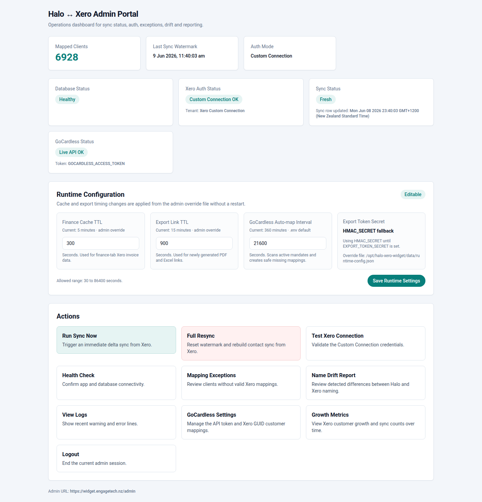
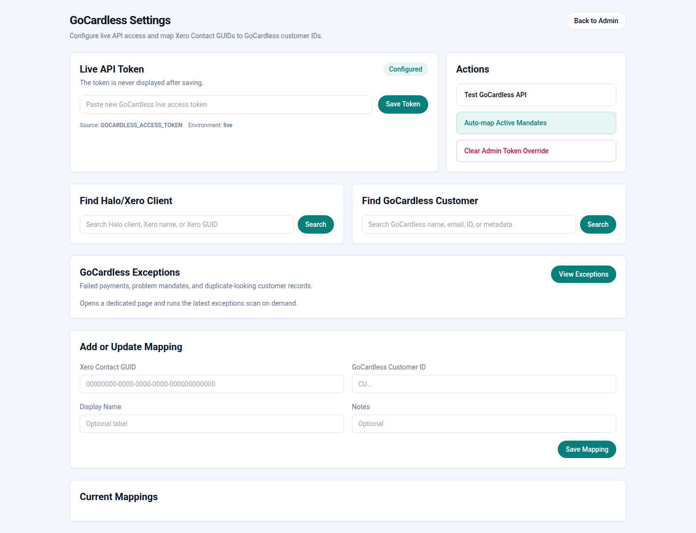
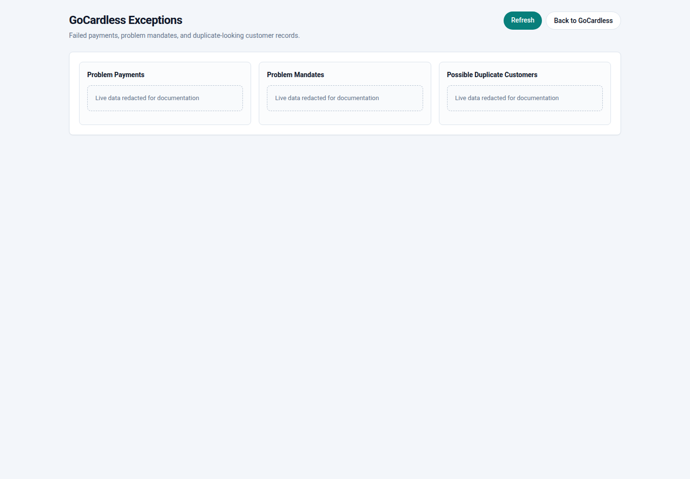
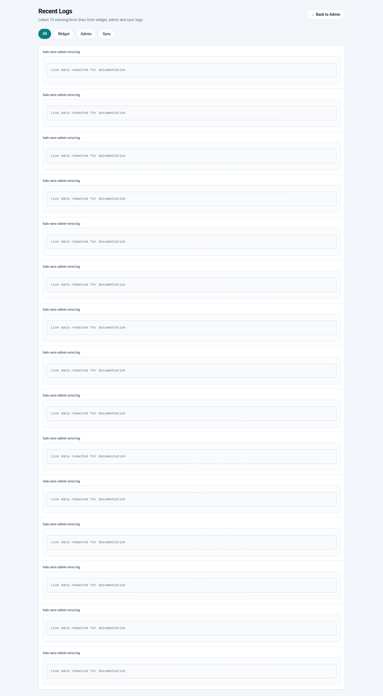
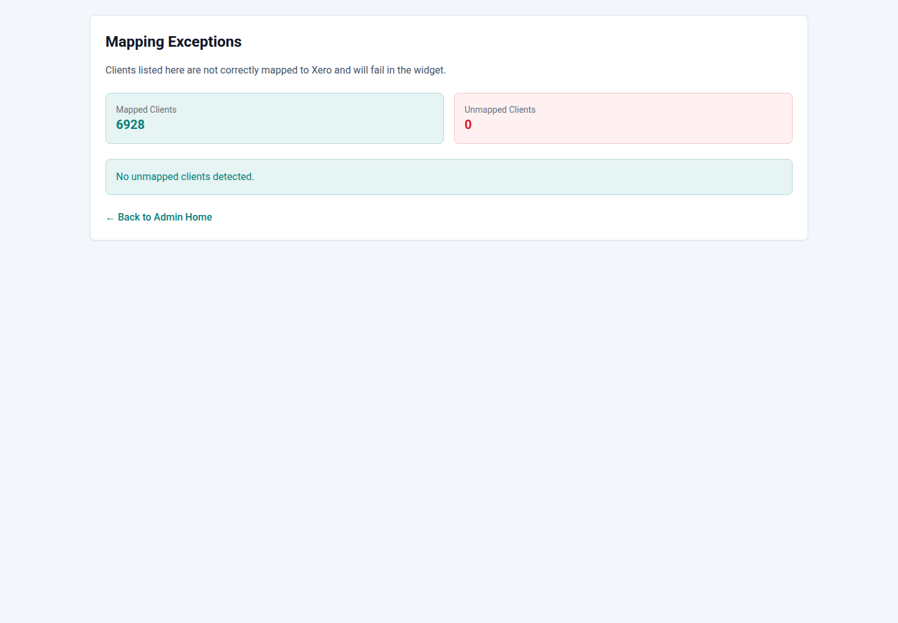

# Halo Xero Widget Admin User Manual

Last updated: 2026-06-09

This manual covers the production admin console at:

```text
https://widget.example.com/admin
```

Screenshots are redacted for documentation. Live customer rows, payment IDs,
logs, and exception details are intentionally hidden.

## 1. Sign In

Open `/admin` and sign in with an admin username and password. If MFA is
enabled for that account, the login page then asks for a six-digit code from
the enrolled authenticator app.

The admin session cookie is separate from the Halo finance tab and is valid for
the configured session period.

## 2. Dashboard



The dashboard gives a quick operational view:

- Database connectivity.
- Halo API health.
- Xero Custom Connection health.
- GoCardless API health.
- Last Xero contact sync state.
- Runtime configuration for cache, export links, and GoCardless auto-map.
- Grouped action sections for API connections, sync/data tasks, and operations.
- Signed-in admin profile block with quick links to profile management and
  logout.

### Runtime Configuration

Use **Runtime Configuration** to adjust:

- Finance Cache TTL: how long finance tab data is cached per Xero Contact GUID.
- Export Link TTL: how long generated PDF/Excel links remain valid.
- GoCardless Auto-map Interval: how often the admin service scans active
  GoCardless mandates and creates safe missing mappings.

Changes are written to the runtime config JSON file and are picked up without a
service restart.

### Halo API Check

Use **Halo API** or open `/admin/PSA` to configure and validate the Halo
client-credentials application. The client secret is write-only; leave it blank
to keep the current secret. The page can request a bearer token and perform a
read-only client list call. It does not update Halo records.

The same page can sync the Halo Area custom field **Active Direct Debit
Mandate** (`CFDirectDebitActive`, ID `278`). Run **Dry Run Sync** first to check
how many mapped customers would change, then **Sync to Halo** to write `Active`,
`Not active`, or `Cancelled`. The scheduled GoCardless auto-map also runs this
Halo field sync so new safe mappings are pushed back into Halo automatically.

## 3. GoCardless Settings



Use **GoCardless Settings** to:

- Save or clear the GoCardless API token override.
- Test the GoCardless API.
- Copy the GoCardless webhook URL and save the webhook endpoint secret.
- Run the eligible mandate auto-map manually.
- Reconcile mapped GoCardless mandates using the public API fallback.
- Search Halo/Xero clients by name or Xero Contact GUID.
- Search GoCardless customers by name, email, ID, or metadata.
- Review unmapped eligible GoCardless mandates and click **Map Now** to map
  them to the selected Halo/Xero customer.
- Add or update a manual Xero Contact GUID to GoCardless customer mapping.
- Open the dedicated GoCardless Exceptions page.

### Automatic Mapping Rules

The auto-map process only creates a mapping when it has a safe match:

- GoCardless exposes a Xero Contact GUID in metadata or related fields.
- The GoCardless customer has an active or in-progress mandate and the customer
  name exactly matches one unambiguous Halo client with a Xero Contact GUID.
- The GoCardless customer email resolves to exactly one Xero Contact, and that
  Xero Contact GUID exists in Halo.

In-progress GoCardless mandate statuses are `pending_customer_approval`,
`pending_submission`, and `submitted`. These statuses are eligible for safe
mapping so the finance tab can show the live GoCardless state instead of
**Mandate Unknown**. They are not treated as **Mandate Active** until
GoCardless reports the mandate status as `active` or the customer record has
`active_mandates: true`.

Existing manual mappings are preserved. A GoCardless customer already mapped to
another Xero GUID is skipped.

### Webhook Behaviour

Configure the GoCardless webhook endpoint as:

```text
https://widget.engagetech.nz/webhooks/gocardless
```

Paste the GoCardless endpoint secret into the **Webhook Endpoint** panel. The
secret is never displayed after saving. The widget verifies
`Webhook-Signature`, stores each event ID once, and records mandate status
changes for audit and finance-tab display.

Webhook `mandates / active` events are treated as active. Webhook `cancelled`,
`failed`, and `expired` events are treated as inactive/problem states. Pending
events are stored as factual statuses but are not treated as active.

The manual **Reconcile GoCardless Mandates** action fetches mandate statuses
from the public GoCardless API for mapped customers. It stores API fallback
state only where webhook-derived state would not be overwritten.

### Unmapped Mandates

The **Unmapped GoCardless Mandates** panel lists active and in-progress
GoCardless customers that are not present in the widget mapping table. Use the
candidate selector when a safe Halo/Xero candidate is shown, or paste the Xero
Contact GUID manually, then click **Map Now**. The action saves the mapping and
checks the Halo Direct Debit custom field for that customer.

## 4. GoCardless Exceptions



Open `/admin/gocardless/exceptions` from the GoCardless Settings panel.

This page runs the exception scan on demand and shows:

- Failed or cancelled payments.
- Failed, expired, or cancelled mandates.
- Possible duplicate GoCardless customer records.

Use this page when investigating why a customer does not show **Mandate Active**
in the Halo finance tab or when reconciling Direct Debit issues.

## 5. Logs



Use `/admin/logs` to inspect PM2 and sync logs from the admin console.
The log viewer supports source filters, severity filters, preset/custom
timeframes, and free-text search. New service and sync log entries are written
with timestamps; older historical lines that were created before timestamping
was enabled are marked as legacy lines and can be included with the **Include
legacy lines** option.

Typical checks:

- `halo-xero-error.log` for finance tab runtime errors.
- `halo-xero-admin-error.log` for admin console errors.
- Sync logs for Xero contact sync failures.

Sensitive log contents are redacted in this documentation screenshot.

### Health Check

Use **Health Check** from the Operations action group to view a readable status
page for database, Xero, GoCardless, Halo API, and Xero contact sync health.
Machine-readable output remains available at `/admin/health.json`.

### Growth Metrics

Use **Growth Metrics** from the Operations action group to review Xero client
growth and mapped-contact coverage over time. The page defaults to the last 30
days and supports preset ranges for 7 days, 30 days, 90 days, 1 year, all time,
or a custom date range. Summary cards show the latest totals and the change
across the selected range. Busy ranges are bucketed for readability, using the
latest recorded snapshot per hour, day, week, or month depending on the selected
range.

### Admin Users

Use **Admin Users** from the Operations action group to create admin accounts,
set passwords, unlock accounts, enable/disable users, and review login audit
history. Passwords are stored as bcrypt hashes. By default, an account is locked
for 15 minutes after 3 failed login attempts; these thresholds can be changed
with `ADMIN_MAX_FAILED_LOGINS` and `ADMIN_LOCKOUT_MINUTES`.

Use **Profile** to enroll MFA for your own account. Scan the QR code with a
TOTP authenticator app, then enter the six-digit code to enable MFA. Admins can
reset MFA for another user from **Admin Users** if a device is lost; the user
can then enroll again from **Profile**.

### Alerts

Use **Alerts** from the Operations action group to configure Microsoft Teams
alerts with a webhook URL and send a test notification. Alerts are sent for
admin account lockouts, failed sync jobs, stale Xero contact sync, failed
GoCardless webhook processing, and PM2 service health issues. Routine
successful jobs are not alerted.

## 6. App Exceptions



Use `/admin/exceptions` to inspect stored sync/app exceptions. This is separate
from GoCardless Exceptions and is focused on the widget and Xero sync layer.

## 7. Finance Tab Behaviour

The Halo finance tab is anchored by Xero Contact GUID. It shows:

- Account balance and overdue balance.
- Open invoice rows, with invoice numbers linking to the customer-facing Xero
  online invoice when Xero provides an `OnlineInvoiceUrl`.
- GoCardless Direct Debit status.

The GoCardless status labels are:

- **Mandate Active**: a mapped GoCardless customer has at least one active
  mandate, GoCardless sends a `mandates / active` webhook, or GoCardless marks
  the customer with `active_mandates: true`. The badge opens the GoCardless
  mandate in the dashboard when available.
- **Mandate pending/submitted**: a mapped customer has an in-progress mandate,
  such as `pending_submission` or `submitted`. The badge opens the GoCardless
  mandate in the dashboard.
- **Mandate Not Active**: a mapped customer exists but no active mandate was
  found.
- **Mandate Unknown**: no GoCardless customer is mapped, GoCardless is not
  configured, or the lookup failed.

Opening the finance tab can also opportunistically create a safe GoCardless
mapping by exact name or unique Xero/GoCardless email match.

## 8. Common Admin Tasks

### Refresh Finance Data

Use the **Refresh** button inside the Halo finance tab. It bypasses the current
cache entry and pulls fresh Xero data.

### Update GoCardless Token

1. Open `/admin/gocardless`.
2. Paste the new live API token into **Live API Token**.
3. Click **Save Token**.
4. Click **Test GoCardless API**.

The token is not displayed after saving.

### Force GoCardless Mapping

1. Open `/admin/gocardless`.
2. Search for the Halo/Xero client.
3. Search for the GoCardless customer.
4. Add the Xero Contact GUID and GoCardless customer ID under **Add or Update
   Mapping**.
5. Save the mapping.

Manual mappings are useful when names or emails do not give a safe automatic
match.

### Run Xero Contact Sync

Use **Run Sync Now** on the dashboard for a normal delta sync.

Use **Full Resync** only when the sync watermark needs to be reset. Full resync
is slower and should be treated as an operational action.

## 9. Recovery

Use the repository script for a fresh install or recovery:

```bash
sudo bash install_halo_xero_widget.sh
```

For a new host, supply a real `.env` file:

```bash
sudo ENV_FILE=/root/halo-xero.env CONFIGURE_NGINX=1 ENABLE_CERTBOT=1 \
  CERTBOT_EMAIL=admin@example.com bash install_halo_xero_widget.sh
```

See `docs/recovery-runbook.md` for the full recovery checklist.
